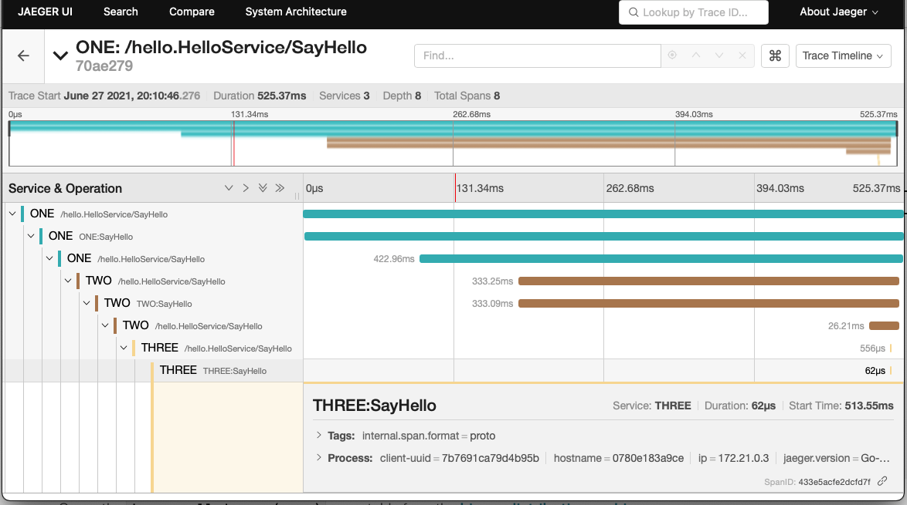

# tracing-with-jaeger

A simple hello service to demonstrate distributed tracing with grpc

## Pre-requisites
Here are the pre-requistices to be installed

1. [docker](https://docs.docker.com/engine/install/)
2. [docker-compose](https://docs.docker.com/compose/install/)
3. [golang](https://golang.org/dl/)

### How to build the services
Run the below commands to download the dependencies to vendor directory, then use docker compose to build the services
```
go mod vendor
docker compose build
```

### How to run the services
```
docker compose up
```
You should be seeing the docker logs as below

```
three_1   | 2021/06/28 02:12:49 Starting service : THREE on :11000
three_1   | 2021/06/28 02:12:49 Loading the tracer from env
two_1     | 2021/06/28 02:12:56 Starting service : TWO on :10000
two_1     | 2021/06/28 02:12:56 Loading the tracer from env
one_1     | 2021/06/28 02:13:03 Starting service : ONE on :9000
one_1     | 2021/06/28 02:13:03 Loading the tracer from env
```

### How to send a request
```
curl --location --request POST 'http://127.0.0.1:9000/sayhello' \
--header 'Content-Type: application/json' \
--data-raw '{
    "msg": "hi",
    "service_id": "THREE"
}'
```
The expected response is from the service THREE
```
{
    "msg": "Hello from service THREE"
}
```

### Tracing in action

You can visit http://localhost:16686/ to view the jaeger UI



You can see the request traveling through different services and the duration it took through out the request, and that what we expect to know from distributed tracing.